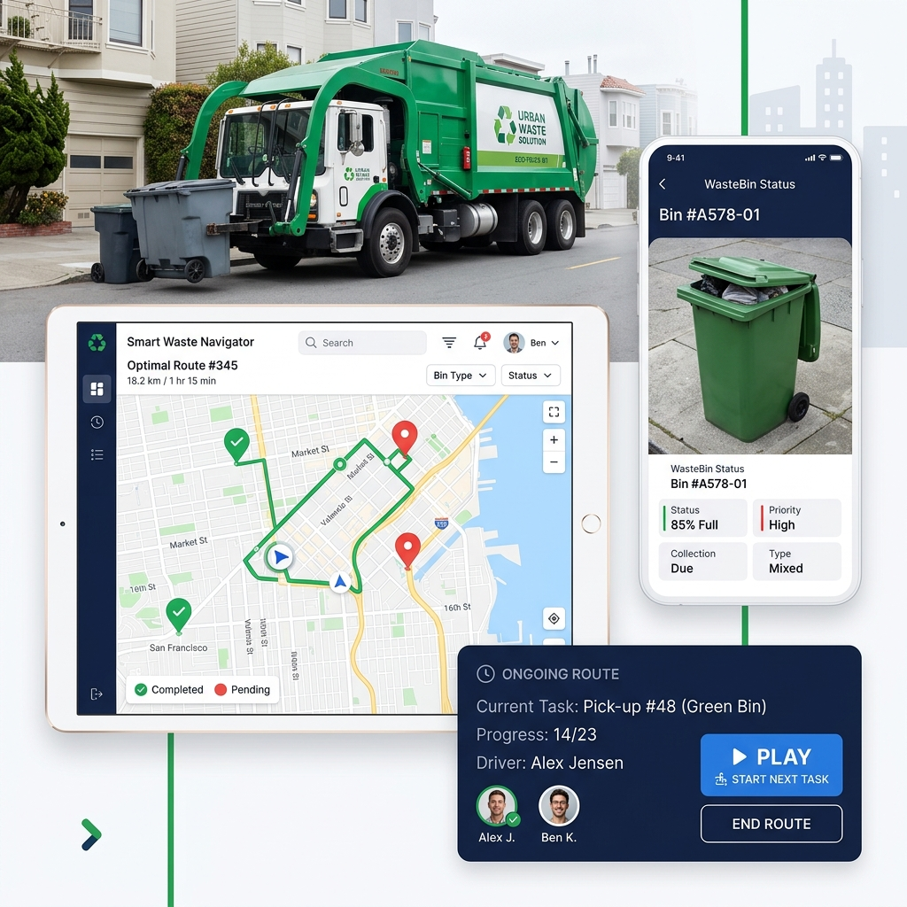
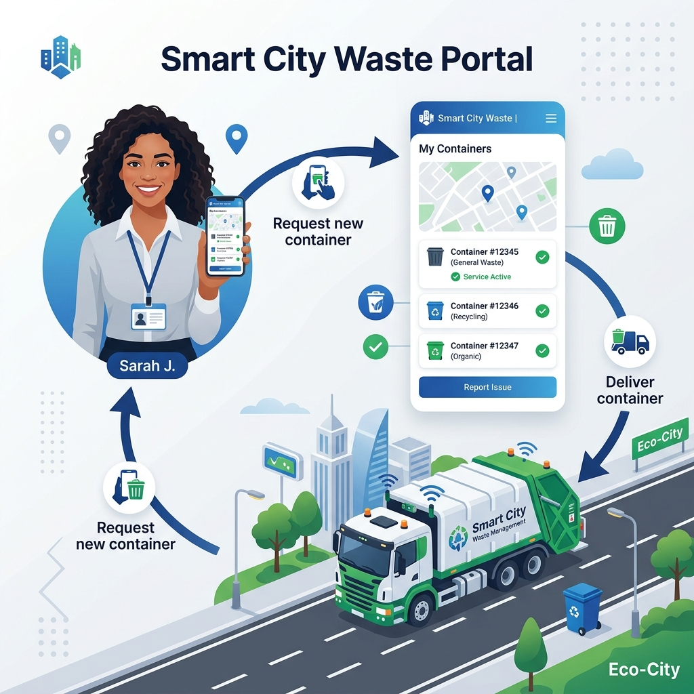
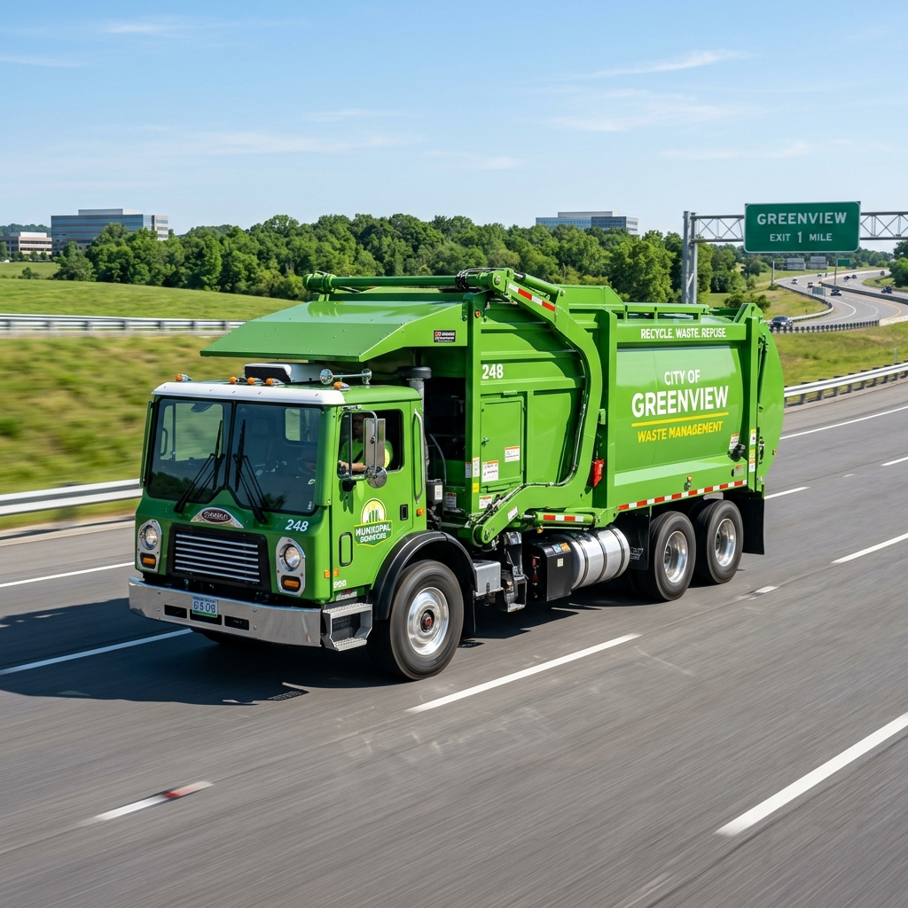
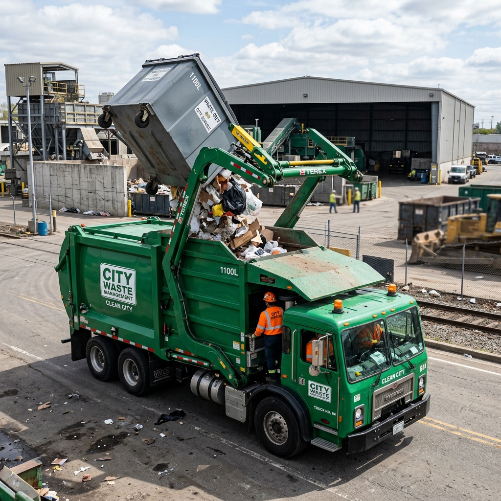
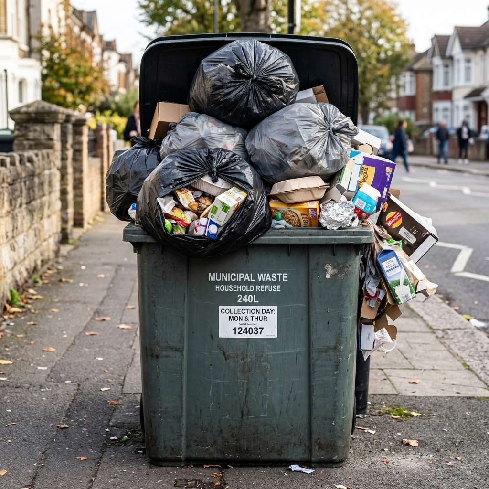
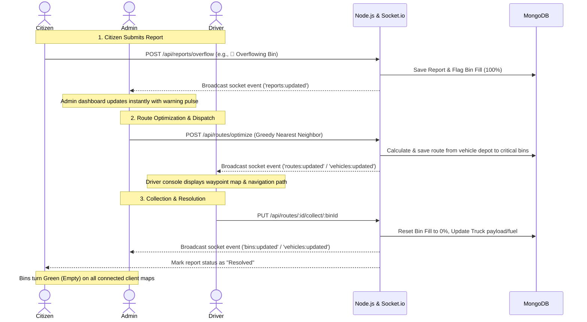

# ♻️WasteGrid - Smart Waste Management Portal

[](https://www.mongodb.com/)
[](https://react.dev/)
[](https://vitejs.dev/)
[](https://socket.io/)
[](https://opensource.org/licenses/MIT)

An enterprise-grade, real-time **MERN (MongoDB, Express, React, Node.js)** web application designed to optimize municipal waste collection tracking and routing. The platform features role-based interfaces for **Admins/Supervisors**, **Drivers/Collectors**, and **Citizens**, integrated with real-time simulations, Leaflet interactive mapping, and a Greedy Nearest Neighbor route optimization algorithm.

---

## 📸 System Preview & Graphics

### 📱 User Interface Mockups
| Driver Navigation & Collection Route | Citizen Self-Service Portal |
| :---: | :---: |
|  |  |

### 🎨 Key Graphics
| Overhead Collection Vehicle | Real-Time Garbage Lifting | Overflowing Smart Bin Alert |
| :---: | :---: | :---: |
|  |  |  |

---

## ✨ Key Features

1. **Role-Based Workflows**:
   - 🏢 **Admin Dashboard**: Real-time aggregated fleet analytics, bin capacity statistics, live citizen reports feed, and automated optimal route dispatching.
   - 🚛 **Driver Console**: Live waypoint navigation, real-time route progress tracker, truck payload monitors, and simple bin collection triggers.
   - 👥 **Citizen Portal**: Interactive neighborhood map showing bin statuses, and digital self-service forms to report overflows, damaged bins, or foul odors.
2. **Real-time Waste & GPS Simulation**:
   - **Waste Accumulation Loop**: Simulates natural waste generation by increasing random bins by 5-15% every 30 seconds.
   - **GPS Vehicle Tracking**: Simulates collector trucks driving through computed paths, moving every 5 seconds to provide visual feedback.
3. **Advanced Route Optimization**:
   - Employs a backend **Greedy Nearest Neighbor Algorithm** to compute the shortest collection path from the vehicle depot to all bins with fill level $\ge 75\%$.
4. **Interactive Leaflet Mapping**:
   - Color-coded status markers, pulsing animations for critical bins, moving vehicle indicators, and custom-styled popup tooltips.
5. **Dual Synchronization Strategy**:
   - Utilizes **Socket.io** for instantaneous, zero-latency events, backed by **10-second REST polling fallback** for bulletproof offline recovery.

---

## ⚙️ Interactive System Architecture

The following sequence diagram details the real-time event pipeline across the different user roles:



---

## 🛠️ Tech Stack

### Frontend
- **Framework**: React.js (Vite)
- **Map Engine**: React Leaflet (OpenStreetMap integration)
- **Data Visualizations**: Recharts
- **Iconography**: Lucide React
- **Styling**: Vanilla Glassmorphic CSS (Emerald Dark & Navy light variables)

### Backend
- **Server**: Node.js & Express.js
- **Real-Time Communication**: Socket.io
- **Security**: JWT Authentication & BcryptJS password hashing
- **Database**: MongoDB (via Mongoose ODM)

---

## 📂 Project Structure

```text
Summer Training/
├── backend/
│   ├── config/          # Database configuration (MongoDB connection)
│   ├── controllers/     # Route business logic (Auth, Bins, Routes, Reports)
│   ├── middleware/      # Auth security filters (JWT validation)
│   ├── models/          # MongoDB/Mongoose schemas (User, Bin, Vehicle, Report, Route)
│   ├── routes/          # Express route declarations
│   ├── server.js        # Server launch point, Socket.io initialization & simulation loops
│   └── .env             # Environment configuration (Mongo URI, JWT Secret)
└── frontend/
    ├── public/          # Static assets & mockups
    ├── src/
    │   ├── components/  # Reusable elements (Navbar, InteractiveMap, Legend)
    │   ├── context/     # Global React context & Socket.io listeners
    │   ├── pages/       # Portal views (AuthPage, AdminDashboard, DriverConsole, CitizenPortal)
    │   ├── index.css    # Emerald Green & Navy Theme Stylesheet
    │   ├── App.jsx      # React router configuration
    │   └── main.jsx     # Vite client mount point
    ├── package.json     # Node scripts & dependencies
    └── vite.config.js   # Vite server properties
```

---

## ⚡ Getting Started & Installation

### Prerequisites
- **Node.js**: `v18.0.0` or higher
- **MongoDB**: A running local MongoDB server or a remote MongoDB Atlas cluster URI.
  - Windows Command to start local service: `net start MongoDB`

### 1. Backend Setup
1. Open a terminal and navigate to the backend directory:
   ```bash
   cd backend
   ```
2. Install dependencies:
   ```bash
   npm install
   ```
3. Create a `.env` file in the `backend/` directory:
   ```env
   MONGO_URI=mongodb://127.0.0.1:27017/smart-waste
   JWT_SECRET=supersecrettokenkey123
   PORT=5000
   ```
4. Start the backend server:
   ```bash
   npm start
   ```
   > [!NOTE]
   > On its first execution, the server automatically seeds the database with mock bins in Chandigarh, 2 drivers, 2 vehicles, and 1 initial citizen report.

### 2. Frontend Setup
1. Open a second terminal window and navigate to the frontend directory:
   ```bash
   cd frontend
   ```
2. Install dependencies:
   ```bash
   npm install
   ```
3. Start the Vite development server:
   ```bash
   npm run dev
   ```
4. Open your browser and navigate to the URL shown in the terminal (typically `http://localhost:5173`).

---

## 👤 Demo Accounts (Auto-Seeded)

The login screen includes shortcut **autofill buttons** at the bottom for instant access.

| Role | Username / Email | Password | Access Level |
|---|---|---|---|
| **Admin Supervisor** | `admin@waste.com` | `admin123` | Full dashboard, fleet operations, route optimizer, analytics |
| **Driver / Collector** | `driver1@waste.com` | `driver123` | Interactive route nav, collection checklists, truck metrics |
| **Citizen (Guest)** | *Direct Access* | *None* | Submission forms, public map tracker, resolved states |

---

## 🔌 API Reference

### Auth
- `POST /api/auth/register` - Create a new user profile
- `POST /api/auth/login` - Authenticate user & retrieve JWT token

### Bins
- `GET /api/bins` - Retrieve status of all smart bins
- `POST /api/bins` - Add a new smart bin (Admin Only)
- `PUT /api/bins/:id` - Edit bin capacity/location
- `DELETE /api/bins/:id` - Remove a bin from the network (Admin Only)

### Vehicles
- `GET /api/vehicles` - Retrieve status of all trucks
- `POST /api/vehicles` - Add a new fleet vehicle (Admin Only)
- `PUT /api/vehicles/:id` - Edit vehicle properties (e.g., active route)
- `DELETE /api/vehicles/:id` - Remove a vehicle (Admin Only)

### Routes
- `GET /api/routes` - Retrieve all dispatched collection paths
- `POST /api/routes/optimize` - Execute Greedy Nearest Neighbor route computation
- `PUT /api/routes/:id/collect/:binId` - Reset a bin state & increment truck load (Driver Only)
- `PUT /api/routes/:id/complete` - Mark route as completed & return vehicle to idle (Driver Only)

### Reports
- `GET /api/reports/overflow` - Fetch all submitted citizen issue forms
- `POST /api/reports/overflow` - Submit a new report
- `PUT /api/reports/overflow/:id` - Update report status (e.g. Verified, Resolved)
- `GET /api/reports/analytics` - Fetch statistics for Recharts dashboard visualizations

---

## 🎨 Map Icon & Legend Reference

| Icon State | Visual Representation | Meaning | Critical Action |
|---|---|---|---|
| 🗑️ **Green Bin** | Steady green dot/marker | Empty / Under Capacity (<50% fill) | Normal state, ignore |
| 🗑️ **Orange Bin** | Steady orange dot/marker | Moderate Capacity (50-75% fill) | Approaching collection limit |
| 🗑️ **Red Bin** | **Pulsing red glow animation** | Critical Overflow ($\ge 75\%$ fill) | Selected by optimizer algorithm |
| 🚙 **Cyan Truck** | Moving blue truck | Vehicle currently executing route | Live GPS path simulation active |
| 🚙 **Gray Truck** | Static gray truck | Idle vehicle at the depot | Ready for dispatch |
| 🚨 / 🤢 / 🔧 | Colored flag markers | Citizen issue (Overflow, odor, damage) | Click to inspect report info |

---

## 💡 Recommended Testing Workflow

To experience the real-time websocket integration, we recommend opening **three browser windows side-by-side**:

1. **Window 1 (Citizen)**: Go to `/citizen`, zoom in on the map. Click a bin location and report it as "Overflowing (🚨)".
2. **Window 2 (Admin)**: Log in as `admin@waste.com`. You will instantly see the new citizen alert popup on the map without refreshing. Click **Optimize Route** for an idle vehicle.
3. **Window 3 (Driver)**: Log in as `driver1@waste.com`. The console will display the optimized route markers.
4. **Execution**: In the Driver console, click **Collect** on the first waypoint. In the Admin and Citizen windows, you will see the bin marker dynamically turn green and the vehicle icon move along the street grid in real time.

---

## 🤝 License & Support

This project is licensed under the MIT License. For additional documentation, configuration details, or troubleshooting, please refer to [REAL_TIME_SETUP.md](file:///c:/Users/Anubhav%20Akhil/Desktop/Summer%20Training/REAL_TIME_SETUP.md) and [QUICK_START.md](file:///c:/Users/Anubhav%20Akhil/Desktop/Summer%20Training/QUICK_START.md).

For inquiries or setup support, verify backend server execution logs (`localhost:5000`) and browser console warnings (F12).

---
*Happy Waste Management! 🌱♻️*
*Last updated: July 2026*

---
<p align="center">
  <b>Designed & Developed with ❤️ by Anubhav</b>
</p>
